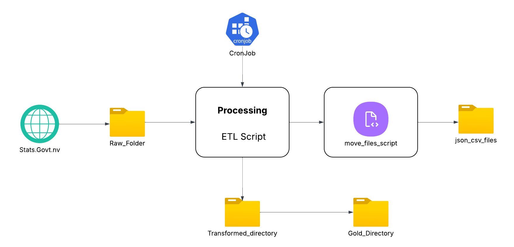

# CoreDataEngineers ETL Pipeline Project

## Project Overview

This project implements a comprehensive ETL (Extract, Transform, Load) pipeline using Bash scripting for CoreDataEngineers' data infrastructure. The solution includes automated data processing, database management, and competitive analysis capabilities for the company's expansion into sales of goods and services.

## Business Context

CoreDataEngineers is diversifying into sales and needs to analyze competitor data from Parch and Posey while establishing robust data processing capabilities. This project delivers:

- Automated ETL pipeline for New Zealand Annual Enterprise Survey data
- PostgreSQL database setup for Parch and Posey competitor analysis
- Scheduled data processing workflows
- File management automation

## Architecture Overview



The architecture demonstrates the complete data flow from extraction through transformation to final loading, including database integration and scheduling components.


## Features

### 1. Automated ETL Pipeline (`etl_script.sh`)

**Extract Phase:**
- Downloads New Zealand Annual Enterprise Survey data from Stats NZ
- Uses environment variables for configuration
- Validates successful download and file integrity
- Stores raw data in dedicated `raw/` directory

**Transform Phase:**
- Renames `Variable_code` column to `variable_code`
- Selects specific columns: `year`, `Value`, `Units`, `variable_code`
- Creates clean, structured output file `2023_year_finance.csv`
- Saves transformed data to `Transformed/` directory

**Load Phase:**
- Copies processed data to `Gold/` directory for production use
- Provides comprehensive validation and logging
- Confirms successful completion of each step

### 2. Database Management (`setup_posey_db.sh`)

- Creates PostgreSQL database named `posey`
- Automatically creates tables for all Parch & Posey data:
  - `region` - Geographic regions
  - `sales_reps` - Sales representative information
  - `accounts` - Customer account details
  - `orders` - Sales transaction records
  - `web_events` - Website interaction data
- Loads CSV data into respective tables
- Handles data type conversions and constraints

### 3. File Organization (`move_files.sh`)

- Automatically moves CSV and JSON files to `json_and_CSV/` directory
- Handles multiple file types and quantities
- Provides confirmation of successful file operations
- Maintains organized file structure

### 4. Competitive Analysis Queries

SQL scripts addressing key business questions:

**Order Analysis:**
- Identifies high-volume orders (gloss_qty or poster_qty > 4000)
- Finds orders with zero standard quantity but high specialty quantities

**Customer Analysis:**
- Locates companies starting with 'C' or 'W'
- Filters contacts containing 'ana' or 'Ana' (excluding 'eana')

**Sales Performance:**
- Regional sales rep and account relationships
- Alphabetically sorted account listings

## Installation & Setup

### Prerequisites

```bash
# Required system components
- Linux Operating System
- PostgreSQL database server
- Bash shell (version 4.0+)
- wget utility
- Standard Unix tools (cut, tail, wc, awk)
```

### Database Setup

```bash
# Install PostgreSQL (Ubuntu/Debian)
sudo apt update
sudo apt install postgresql postgresql-contrib

# Start PostgreSQL service
sudo systemctl start postgresql
sudo systemctl enable postgresql
```

## Usage Instructions

### 1. Run Complete ETL Pipeline

```bash
cd Scripts
chmod +x *.sh
./etl_script.sh
```

### 2. Setup Competitor Database

```bash
./setup_posey_db.sh
```

### 3. Organize Files

```bash
./move_files.sh
```

### 4. Schedule Daily Execution

```bash
# Add to crontab for daily execution at 12:00 AM
crontab -e

# Add this line (replace with your actual project path):
0 0 * * * /path/to/your/project/Scripts/etl_script.sh
```

## Data Sources

### Primary Dataset
- **Source:** Stats NZ Annual Enterprise Survey 2023
- **URL:** https://www.stats.govt.nz/assets/Uploads/Annual-enterprise-survey/Annual-enterprise-survey-2023-financial-year-provisional/Download-data/annual-enterprise-survey-2023-financial-year-provisional.csv
- **Format:** CSV
- **Purpose:** Economic analysis and reporting

### Competitor Data (Parch & Posey)
- **Tables:** 5 interconnected tables
- **Records:** ~50K+ total records across all tables
- **Purpose:** Market analysis and competitive intelligence

## Key Business Questions Answered

### 1. High-Volume Order Identification
```sql
-- Orders with gloss_qty or poster_qty > 4000
SELECT id FROM orders 
WHERE gloss_qty > 4000 OR poster_qty > 4000;
```

### 2. Specialty Order Analysis
```sql
-- Zero standard quantity with high specialty volumes
SELECT * FROM orders 
WHERE standard_qty = 0 AND (gloss_qty > 1000 OR poster_qty > 1000);
```

### 3. Target Customer Identification
```sql
-- Companies starting with C/W with specific contact criteria
SELECT name FROM accounts 
WHERE (name LIKE 'C%' OR name LIKE 'W%') 
AND (primary_poc LIKE '%ana%' OR primary_poc LIKE '%Ana%') 
AND primary_poc NOT LIKE '%eana%';
```

### 4. Sales Territory Mapping
```sql
-- Regional sales rep and account relationships
SELECT r.name as region_name, s.name as sales_rep_name, a.name as account_name
FROM region r
JOIN sales_reps s ON r.id = s.region_id
JOIN accounts a ON s.id = a.sales_rep_id
ORDER BY a.name;
```

## Monitoring & Validation

### Pipeline Health Checks

```bash
# Verify ETL completion
ls -la raw/ Transformed/ Gold/

# Check data quality
head -5 Gold/2023_year_finance.csv
wc -l Gold/2023_year_finance.csv

# Database validation
sudo -u postgres psql -d posey -c "SELECT 'region' as table_name, COUNT(*) FROM region;"
```

### Error Handling

The pipeline includes comprehensive error checking:
- File download validation
- Directory creation confirmation
- Data transformation verification
- Database connection testing
- Load operation success confirmation

## Automation Features

### Cron Job Configuration
- **Schedule:** Daily at 12:00 AM
- **Command:** Executes complete ETL pipeline
- **Logging:** Captures execution results
- **Error Handling:** Provides failure notifications

### Environment Variables
```bash
export CSV_URL="https://www.stats.govt.nz/assets/Uploads/Annual-enterprise-survey/..."
```

## Performance Metrics

- **Extract Time:** ~30 seconds (network dependent)
- **Transform Time:** ~5 seconds
- **Load Time:** ~2 seconds
- **Database Setup:** ~60 seconds
- **Total Pipeline:** ~2 minutes end-to-end

## Security Considerations

- Database credentials managed through PostgreSQL authentication
- File permissions set appropriately (644 for data, 755 for scripts)
- No sensitive data exposed in version control
- Environment variables used for external URLs

## Troubleshooting

### Common Issues

1. **Download Failures:**
   - Check internet connectivity
   - Verify CSV_URL environment variable
   - Ensure sufficient disk space

2. **Database Connection:**
   - Confirm PostgreSQL service is running
   - Verify user permissions
   - Check database existence

3. **Permission Errors:**
   - Ensure scripts are executable (`chmod +x`)
   - Verify directory write permissions
   - Check PostgreSQL user access
